# 소스 빌드

## 1. 빌드 환경 설정

- 네이버 클라우드 플랫폼에서 사용할 빌드 환경(예: JDK 버전, 빌드 도구 등)을 설정합니다. \
   _다음 예시는 maven 프로젝트를 기준으로 한 사진입니다._  
   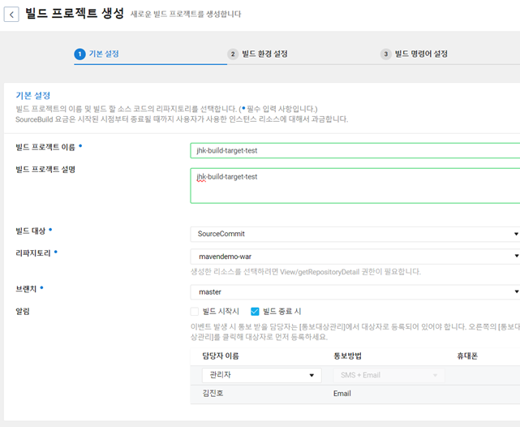
   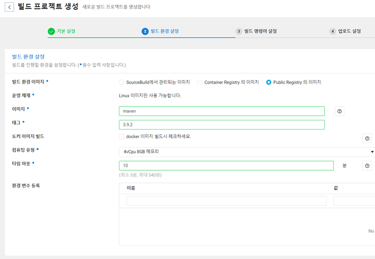

   - 도커이미지는 도커 허브에서 검색할 수 있습니다.  
   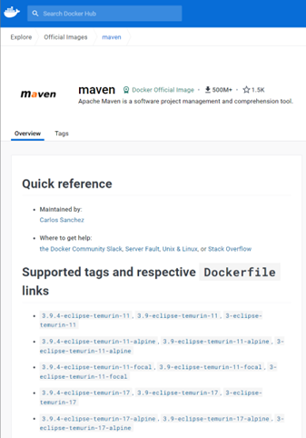 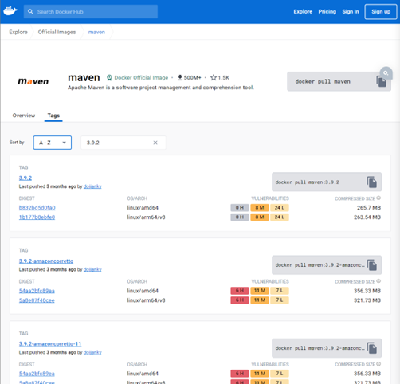

## 2. **빌드 스크립트 작성**
   - 프로젝트에 맞는 빌드 스크립트(예: Maven의 pom.xml 또는 Gradle의 build.gradle)를 작성합니다.
   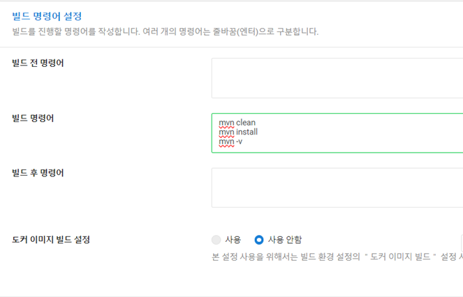 
   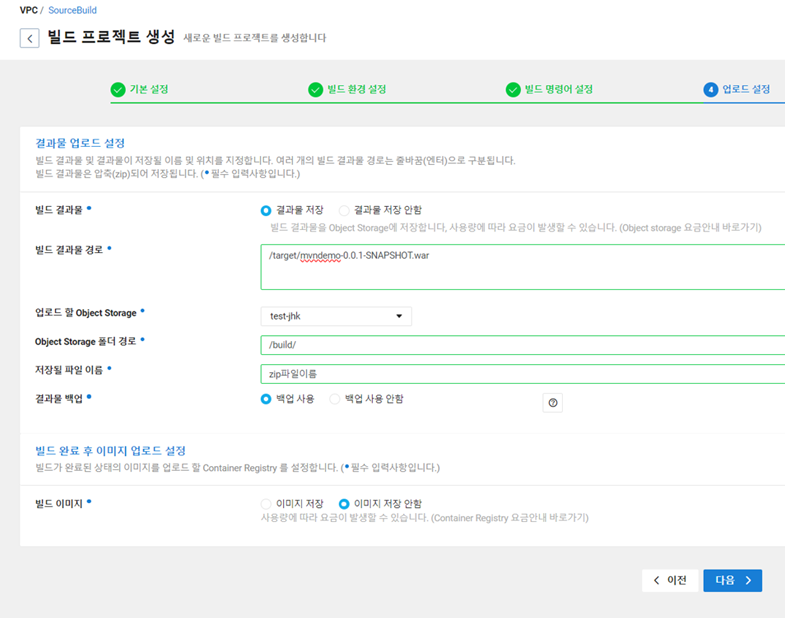
   - 빌드 결과물 경로
   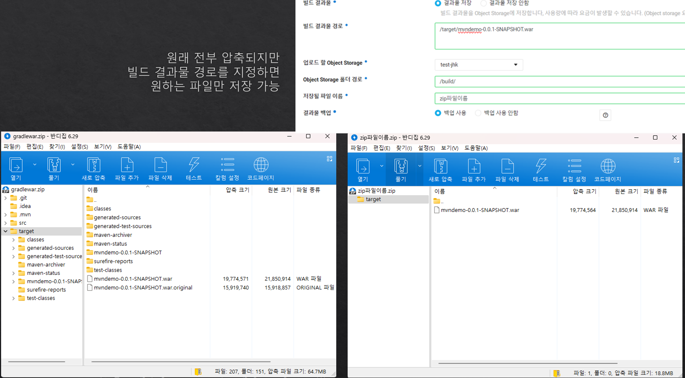

# 소스 디플로이

## 1. **디플로이 환경 설정**
- 배포할 서버의 환경을 설정(ex: Tomcat 설정, 디렉토리 구조 등)
- 배포 스테이지 생성 (배포타겟 `Server`) #추후에 다른 타겟 시나리오 작성 [#에이전트 설치방법](#에이전트-설치)
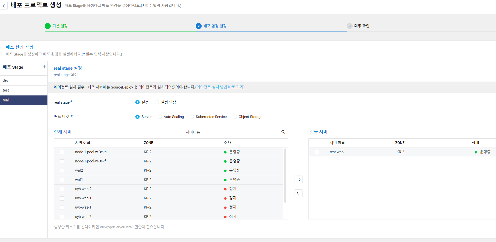
- 배포 시나리오 생성
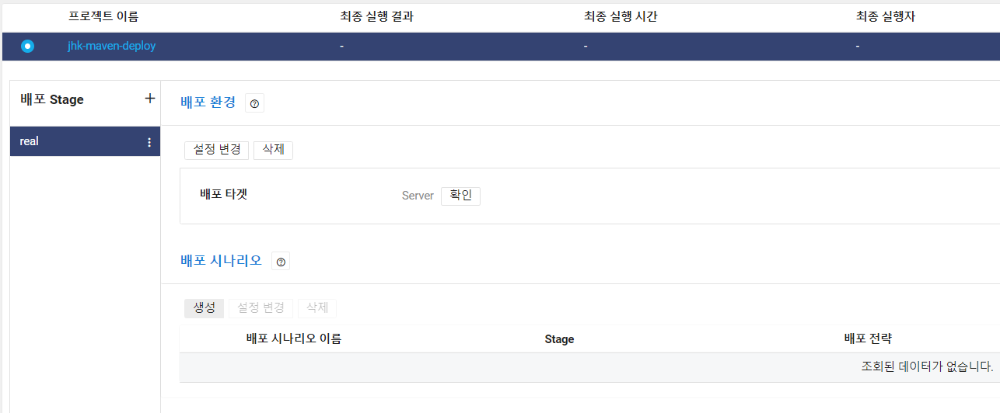  
- 배포 전략 설정  
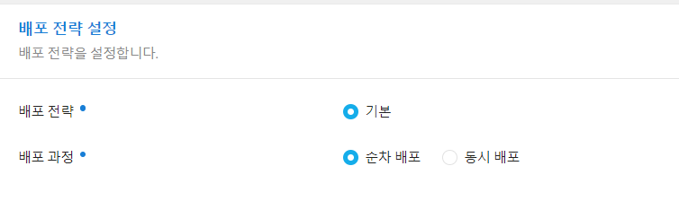
- 배포 파일 설정(Souce Build | Object Storage)
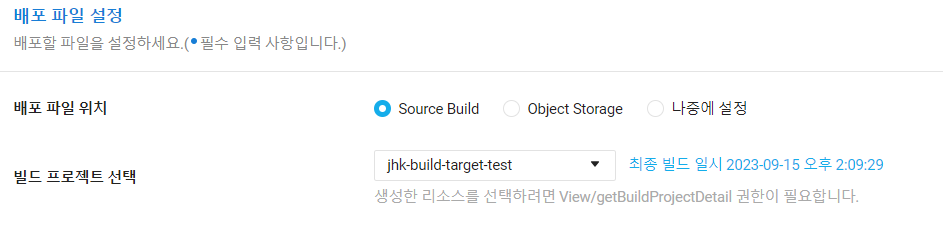
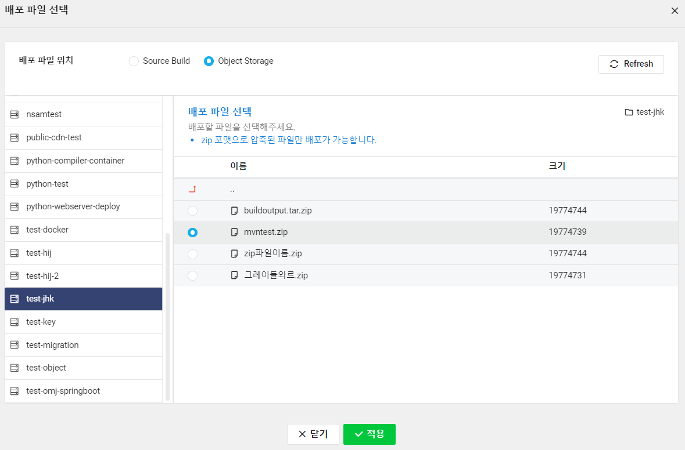

## 2. **배포 시나리오 설정**
배포 명령어 설정

- 배포 전 실행 명령어
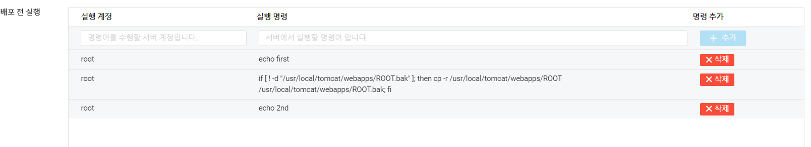
    ```sh
    if [ ! -d "/usr/local/tomcat/webapps/ROOT.bak" ]; then cp -r /usr/local/tomcat/webapps/ROOT /usr/local/tomcat/webapps/ROOT.bak; fi
    #/usr/local/tomcat/webapps/ROOT.bak 디렉토리가 존재하지 않을 경우에만 ROOT 디렉토리를 ROOT.bak으로 복사합니다.
    ```
- 파일 배포
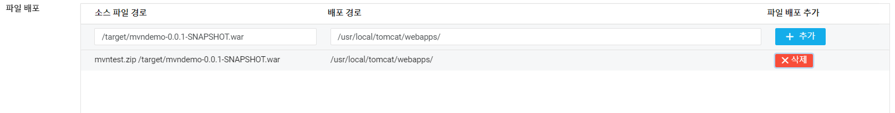 \
(mvntest.zip 파일구조 참고) 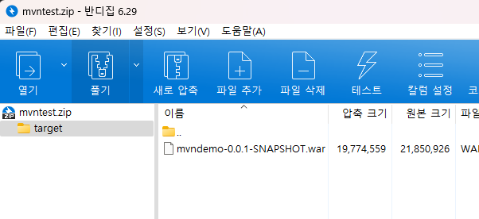 
    ```sh
    #소스 파일 경로 
    #('/'는 테스트 결과{'/opt/sourcedeploy/working/127356/source/'} 에러발생시 참고)
    /target/mvndemo-0.0.1-SNAPSHOT.war
    #배포 경로
    /usr/local/tomcat/webapps/
    ```

- 배포 후 실행 명령어
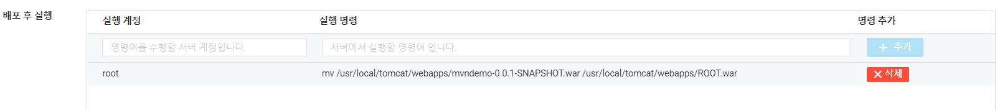
ROOT폴더로 배포하기
    ```sh
    # 배포 후 실행 명령어
    # 배포된 mvndemo-0.0.1-SNAPSHOT.war 파일을 ROOT.war로 이름을 변경합니다.
    mv /usr/local/tomcat/webapps/mvndemo-0.0.1-SNAPSHOT.war /usr/local/tomcat/webapps/ROOT.war
    ```
    추가 설정 (옵션) \
    •	Tomcat 서버를 재시작해야 하는 경우, 배포 후 실행 명령어에 systemctl restart tomcat을 추가합니다.


# 소스 파이프라인 생성

1. **파이프라인 설정**
   - 빌드와 디플로이를 자동화하기 위한 파이프라인을 설정합니다.

2. **파이프라인 실행**
   - 설정한 파이프라인을 실행하여 전체 프로세스가 잘 작동하는지 확인합니다.


---

## 에이전트 설치
민간존 기준임
### 직접 서버 접속 후 작성
```sh
# `accesskey`에 API 인증키 Access Key ID를 입력해 주십시오.
# `secretkey`에 API 인증키 Secret Key를 입력해 주십시오.
echo $'NCP_ACCESS_KEY=accesskey\nNCP_SECRET_KEY=secretkey' > /opt/NCP_AUTH_KEY
chmod 400 /opt/NCP_AUTH_KEY
wget https://sourcedeploy-agent.apigw.ntruss.com/agent/vpc/download/install
# wget https://sourcedeploy-agent.apigw.ntruss.com/agent/v2/download/install #클래식(KR)
chmod 755 install
./install
# rm -rf install
service sourcedeploy start
service sourcedeploy status
```
- 에이전트 프로세스 확인
    ```sh
    ps -ef | grep main.py 
    ```
    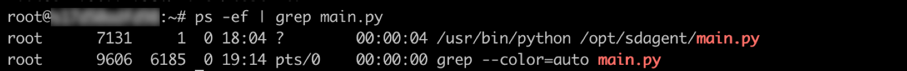

### Init Script 작성
```sh
#!/bin/bash
echo $'NCP_ACCESS_KEY=accesskey\nNCP_SECRET_KEY=secretkey' > /opt/NCP_AUTH_KEY
chmod 400 /opt/NCP_AUTH_KEY
wget https://sourcedeploy-agent.apigw.ntruss.com/agent/vpc/download/install
chmod 755 install
./install
# rm -rf install
```
`accesskey`에 API 인증키 Access Key ID를 입력해 주십시오. \
`secretkey`에 API 인증키 Secret Key를 입력해 주십시오.

> https://guide.ncloud-docs.com/docs/devtools-devtools-4-4 #에이전트 설치 및 관리 NCP 가이드
---